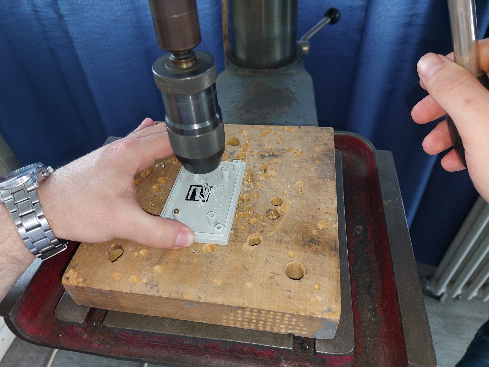
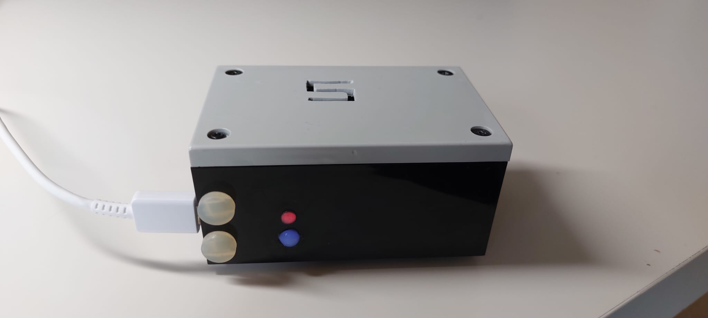

# ESP32 Formaldehyd Temperature Humidity Monitor

## 📈 Projektbeschreibung / Project Description

Dieses Projekt dient der Echtzeitüberwachung der Luftqualität durch Messung von Formaldehyd (HCHO), Temperatur und Luftfeuchtigkeit mit einem **ESP32 Mikrocontroller** und einem **Sensirion SFA30** Sensor. 
Die Messergebnisse werden über einen lokalen **Webserver** angezeigt.

This project monitors air quality in real-time by measuring formaldehyde (HCHO), temperature, and humidity using an **ESP32 microcontroller** and a **Sensirion SFA30** sensor. 
The measurements are displayed via a local **web server**.

---

## 🏡 Funktionen / Features
- Messung von Formaldehyd (ppm), Temperatur (C°) und Luftfeuchtigkeit (% RH)
- Anzeige der Werte über Webinterface
- LED-Statusanzeigen (WLAN, Webserver, Fehler)
- Energieoptimierter Betrieb (Low-Power-Modi)
- Kompaktes Gehäusedesign

- Measurement of formaldehyde (ppm), temperature (C°), and humidity (% RH)
- Display of values via web interface
- LED status indicators (WiFi, server, errors)
- Low-power optimized operation
- Compact enclosure design

---

## 🛏️ Aufbau und Gehäuse / Build and Housing

| Vorbereitung | Bohren & Sensorplatzierung | Gehäuse Fertig |
|:---|:---|:---|
|  |  |  |

Weitere Bilder / More images:
- [Fertig gelötet / Soldered](Bilder/Gehäuse/Fertig_geloetet.jpg)
- [Sensoröffnung / Sensor Opening](Bilder/Gehäuse/Offnung_fuer_Sensor.jpg)

---

## 🔧 Schaltpläne / Schematics
- [I2C-Kommunikationsschema](Bilder/Schaltpläne/I2C_Kommunikation.png)
- [I2C-Bus Aufbau](Bilder/Schaltpläne/I2C_BUS.jpg)

---

## 📊 Luftqualitätsbewertung / Air Quality Rating (Formaldehyde Levels)

| Bereich (German) | Bereich (English) | Farbe / Color | Konzentration (ppm) | Quelle / Source |
|:---|:---|:---|:---|:---|
| Gut | Good | 🟢 Grün / Green | 0.000 - 0.050 | WHO / Umweltbundesamt |
| Mittel | Moderate | 🟡 Gelb / Yellow | 0.051 - 0.080 | WHO / Umweltbundesamt |
| Schlecht | Poor | 🔴 Rot / Red | > 0.080 | WHO / Umweltbundesamt |

**Quelle / Source:** World Health Organization (WHO) and German Federal Environment Agency (Umweltbundesamt).

Beispiel Webinterface / Example Interface:
- [Gute Luft / Good Air](Bilder/Webinterface_Screenshots/Im_gruenen_Bereich.jpeg)
- [Erhöhte Werte / Elevated Values](Bilder/Webinterface_Screenshots/Formaldehyd_Temperatur_rot.jpeg)

---

## 📺 LED-Statusanzeigen / LED Status Indicators

| Zustand / Status | LED-Blinkmuster / Blink Pattern |
|:---|:---|
| Kein WLAN verbunden / No WiFi | Langsames Blinken (1s AN, 1s AUS) |
| WLAN verbunden, kein Client / WiFi connected, no client | Schnelles Blinken (0.2s AN, 0.2s AUS) |
| Client verbunden / Client connected | Dauerleuchten / Constant ON |
| Fehler (Sensor) / Sensor Error | Dreifaches schnelles Blinken / Triple quick flash |

---

## 🛠️ Technologien / Technologies
- C++ / Arduino IDE
- ESP32 WiFi Library
- HTTP Server Library
- Sensirion SFA30 Library
- I2C Communication

---

## 🎥 Demonstrationsvideo / Demo Video

➔ [Demovideo anschauen / Watch demo](Video/VID-20240509-WA0027.mp4)

---

## 👀 Hinweise / Notes
- WLAN Zugangsdaten in `ESP32-Formaldehyde-Temperature-Humidity-Monitor.ino` anpassen.
- IP-Adresse oder `esp32.local` im Browser aufrufen.
- LED blinkt bei Verbindungsproblemen oder Sensorausfall automatisch.

---

## 🔗 Lizenz / License
Dieses Projekt ist unter der MIT-Lizenz veröffentlicht. / This project is licensed under the MIT License.
